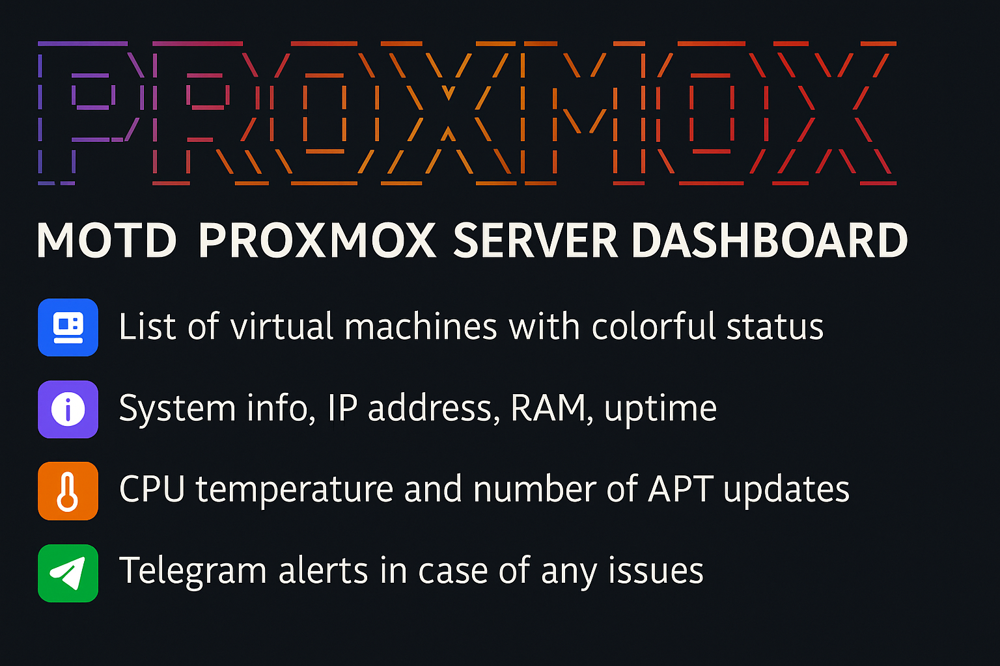
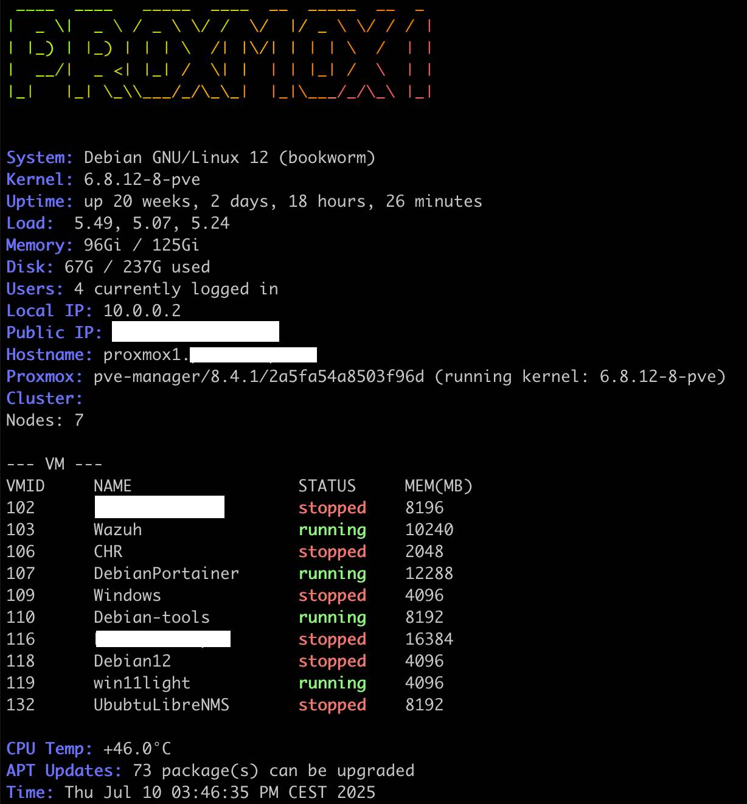

# MOTD Proxmox & Universal Status

Prosty i czytelny MOTD (Message of the Day), który wyświetla kluczowe informacje o systemie podczas logowania (SSH lub lokalnie). Dostępne są dwie wersje: dedykowana dla węzłów Proxmox oraz uniwersalna dla dowolnej maszyny (VM, LXC, bare‑metal).



## ✨ Funkcje

- Kolorowy baner z nazwą hosta (Figlet/Toilet + Lolcat)
 - Kolorowy baner z nazwą hosta (Figlet/Toilet + Lolcat)
   - Automatyczne wykrywanie `lolcat` także pod `/usr/games/lolcat`
   - Fallback: gdy `lolcat` niedostępny, wyświetlany jest baner bez koloru
- Czytelne metryki: system, kernel, uptime, load, pamięć, dysk, użytkownicy, czas
- Odczyt temperatury CPU (jeśli dostępne `lm-sensors`)
- Wersja Proxmox: lista VM i informacje o klastrze
- (Opcjonalnie) alerty Telegram dla wersji Proxmox

## 📂 Zawartość repozytorium

- `motd-proxmox.sh` – dedykowany dla węzłów Proxmox
- `motd-generic.sh` – uniwersalna wersja dla każdej maszyny (VM, LXC, bare-metal)
- `install.sh` – instalator skryptu i zależności

## 🧩 Wymagania

Skrypt wymaga następujących pakietów (mogą zostać zainstalowane przez `install.sh`):

```bash
apt install -y figlet lolcat toilet lsb-release lm-sensors
```

## 🖥️ Instalacja

Uruchom jako root (lub z `sudo`):

```bash
git clone https://github.com/TwojUser/motd-proxmox-status.git
cd motd-proxmox-status
chmod +x install.sh
sudo ./install.sh
```

Instalator zapyta, którą wersję zainstalować i umieści skrypt w `/etc/update-motd.d/`.

### 🚀 Szybki start – jedna komenda

Bez klonowania repozytorium, od razu uruchom instalator:

```bash
curl -fsSL https://raw.githubusercontent.com/arcadiush/motd-proxmox-status/main/install.sh | sudo bash
```

albo przez `wget`:

```bash
wget -qO- https://raw.githubusercontent.com/arcadiush/motd-proxmox-status/main/install.sh | sudo bash
```

Instalator automatycznie wykryje środowisko Proxmox (na podstawie `pveversion` lub `/etc/pve`) i zainstaluje odpowiedni wariant. 

Możesz też wymusić wariant:

```bash
# wymuszenie Proxmox
curl -fsSL https://raw.githubusercontent.com/arcadiush/motd-proxmox-status/main/install.sh | INSTALL_VARIANT=proxmox sudo -E bash

# wymuszenie wersji uniwersalnej
curl -fsSL https://raw.githubusercontent.com/arcadiush/motd-proxmox-status/main/install.sh | INSTALL_VARIANT=generic sudo -E bash
```

## ⚙️ Konfiguracja

W `motd-generic.sh` możesz ustawić styl baneru:

```bash
BANNER_STYLE="figlet"   # lub "toilet"
```

Wersja Proxmox (`motd-proxmox.sh`) obsługuje (opcjonalnie) powiadomienia Telegram. Aby je włączyć, uzupełnij na górze pliku:

```bash
BOT_TOKEN=""
CHAT_ID=""
```

> Uwaga: Alerty są wysyłane tylko, gdy istnieją komunikaty (np. zatrzymane VM lub dużo aktualizacji) i oba pola są wypełnione.

### 📣 Powiadomienia Telegram – monitor w tle

Repo zawiera także skrypty monitorujące, które możesz uruchomić cyklicznie (cron). Wysyłają powiadomienia na Telegram przy wykryciu problemów.

Format wiadomości (przykład):

```
🚨 Alerty Proxmox: NAZWA_HOSTA
• VM 101 (web) status: stopped
• LXC 202 status: paused
• Wysokie obciążenie: load1=6.2 > 4.0
• Wysoka temperatura CPU: 90°C > 85°C
• Mało miejsca na /: 3GB < 5GB
• Dostępnych aktualizacji: 120 >= 50
• Cluster: brak quorum lub problem z klastrem
```

Konfiguracja (ustaw w plikach lub przez zmienne środowiskowe):

```bash
BOT_TOKEN="123456:ABC..."   # token bota
CHAT_ID="-1001234567890"    # ID czatu/kanału
# Progi (domyślne w skryptach):
MAX_LOAD_1=4.0
MAX_CPU_TEMP=85             # °C
MIN_ROOT_FREE_GB=5          # / wolne GB
MAX_UPGRADES=50
```

Proponowane alerty – Proxmox (`monitor-proxmox.sh`):
- Zatrzymane VM/LXC (status inny niż running)
- Wysokie obciążenie (load 1m > `MAX_LOAD_1`)
- Wysoka temperatura CPU (> `MAX_CPU_TEMP`)
- Mało wolnego miejsca na `/` (< `MIN_ROOT_FREE_GB`)
- Dużo aktualizacji APT (>= `MAX_UPGRADES`)
- Problem z klastrem (brak quorum, niedostępne węzły – jeśli dostępne komendy `pvecm`)

Proponowane alerty – wersja uniwersalna (`monitor-generic.sh`):
- Wysokie obciążenie, wysoka temperatura CPU
- Mało wolnego miejsca na `/`
- Dużo aktualizacji APT
- Usługi systemd w stanie `failed`

Uruchomienie w tle (cron):

```bash
# co 5 min Proxmox
*/5 * * * * BOT_TOKEN=xxx CHAT_ID=yyy /usr/local/bin/monitor-proxmox.sh >/dev/null 2>&1

# co 10 min wersja uniwersalna
*/10 * * * * BOT_TOKEN=xxx CHAT_ID=yyy /usr/local/bin/monitor-generic.sh >/dev/null 2>&1
```

## 🖼️ Podgląd

Przykładowy widok panelu informacyjnego:



## 🧹 Odinstalowanie

Usuń odpowiedni plik z katalogu `update-motd.d`:

```bash
sudo rm -f /etc/update-motd.d/10-proxmox
sudo rm -f /etc/update-motd.d/10-generic
```

---

Autor: Arkadiusz Sobacki • PSK‑NET  
Repozytorium: [github.com/TwojUser/motd-proxmox-status](https://github.com/TwojUser/motd-proxmox-status)
